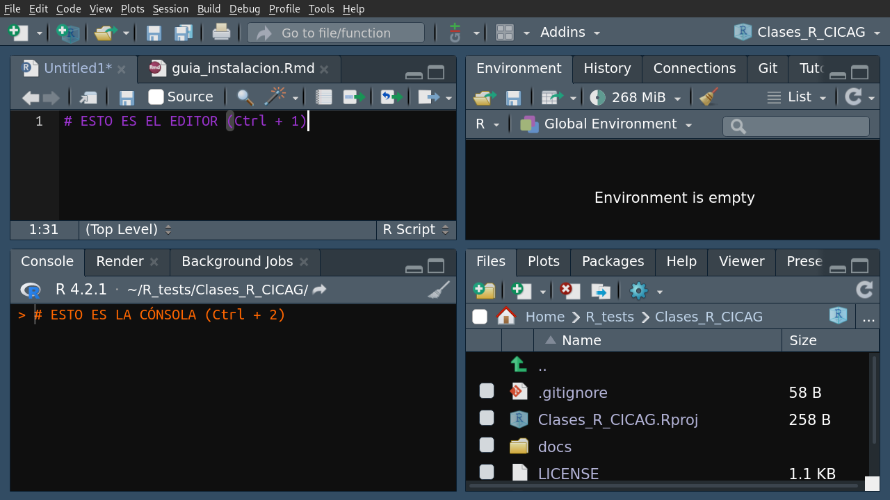

# Curso de R para analísis de calidad de aire y meteorología :sunny: :earth_americas: :factory: 

Mario Gavidia-Calderón
mario.calderon@iag.usp.br

---
## <!--fit-->Hola!

---
## Sobre el profe

* Post-doctorado en el Instituto de Astronomía, Geofísica y Ciencias Atmosféricas de la Universidad de São Paulo. :mortar_board: 
* Trabajo con Modelamiento de la calidad de aire: **WRF-Chem**. :computer:
* Tengo como **10 años** usando R y RStudio. :older_man:
* También tengo un blog sobre R: [**RandRoll**](https://randroll.wordpress.com/). :pencil:
* He creado paquetes en R: [**qualR**](https://github.com/ropensci/qualR). :gift:
* Analísis y figuras creadas en R. :pencil2:
---

## Sobre el curso 

* What you need to know to start doing ~~physics~~ R.
* **Importar** los datos a R e **manipular** **`data.frames`**. 
* Vamos usar datos  y ejemplos de **calidad de aire** y variables **meteorológicas**.
* ~~Dejen de usar Excel~~


---

## Menú

* Introducción: Por qué R?
* Syntaxis básica.
* **data.frames**
* Importar archivos en R.
* Paquetes/Librarías: **`openair`** .
* Plotar los resultados.
* Bonus track: Absolver dudas particulares.

---

## R 
* **Lenguaje de programación** para el **análisis de datos**. 
   * Un sistema para **estadística**. :chart_with_upwards_trend:
   * Un sistema de computación gráfica y **estadística**. :bar_chart:
   * Un ambiente para analísis de datos y **estadística**. :bookmark_tabs:
---
## R (Un paréntesis)
* Estadística: **Ciencia** que nos permite **aprender** del mundo a tráves de los **datos** (Spiegelhater D., 2020) :globe_with_meridians:

* Datos: Uno o más observación sobre un individuo o grupo de individuos. (Rowntree D., 2018) :eyes:

* R = Una herramienta para procesar observaciones y conocer más del mundo 

---
## Por qué R?
* Es **gratis**. :money_with_wings:
* Funciona en **cualquier sistema operativo**. :computer:
* Permite trabajar con una :mount_fuji: de datos.
* Una **gran comunidad de usuarios** : Mucha ayuda on-line. :muscle:
* **Reproducibilidad** de las ciencias! :busts_in_silhouette:

---
## Por qué R?
* Existen **paquetes** para muchas áreas de las ciencias:
    * `openair` $\rightarrow$ contaminación atmosférica. :factory:
    * `sf` y `raster` $\rightarrow$ GIS. :globe_with_meridians:
    * `Rmarkdown`$\rightarrow$ Documentos ~ Latex. :pencil:
    * `shiny` $\rightarrow$ Aplicaciones. :computer:
    * *etc, etc, etc ...*

---
## <!--fit--> Preguntas?

---
## RStudio


---
## RStudio
* Nostros vamos a movernos entre el **editor** y la **cónsola**.

---
## RStudio
* Nostros vamos a movernos entre el **editor** y la **cónsola**.

---
## RStudio
* Nostros vamos a movernos entre el **editor** y la **cónsola**.
---

## Algunas particularidas de R

* En R usamos `<-` para **asignar** variables:

```r
pi <- 3.14
```
* En RStudio el atajo `Alt + -`
* R acepta `=`, pero no es muy aceptado en la comunidad.

---

## Algunas particularidades de R

* R es _**case-sensitive**_:
$x \neq X$
$pi \neq Pi$
$pi \neq pI$

* Es el causante de los **errores iniciales**.
* **Mucho ojo** cuando sigan los ejemplos.

---

## Algunas particularidades de R

* Para definir la ubicación de archivos en Windows se usa **`/`** y no **`\`**.
```r
setwd(c:/Documentos/my_carpeta_de_trabajo/clase1)
```
* Dentro de RStudio es mejor usar TAB para autocompletar.
---
## Vamos a empezar!
<style>
img[alt~="center"]{
  display: block;
  margin: 0 auto;
}
</style>


