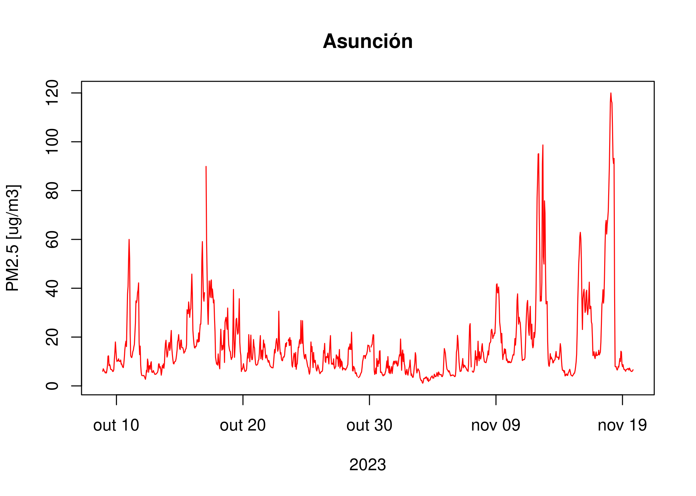

# Curso de R para analísis de calidad de aire y meteorología - Día 5 :sunny: :earth_americas: :factory: 

Mario Gavidia-Calderón
mario.calderon@iag.usp.br

---

## Menú :clipboard:

* ~~Introducción: Por qué R?~~
* ~~Syntaxis básica.~~
* ~~**data.frames**~~
* ~~Importar archivos en R~~ 
* ~~Paquetes/Librerias~~
* Plotar los resultados :point_left:
* Bonus track: Absolver dudas particulares (principalmente hoy).

---
# El repositorio
* Toda la información del curso (presentación, scripts, y ejemplos) están disponibles en:
[https://github.com/quishqa/Clases_R_CICAG](https://github.com/quishqa/Clases_R_CICAG) :takeout_box:

---
## <!--fit--> Un repaso :eyeglasses:

---
## <!--fit--> :framed_picture: $>$  :speech_balloon:
---
## Plots: Cómo hacer buenas figuras?
<style>
blockquote {
/*    border-top: 0.1em dashed #555; */
    font-size: 60%;
    margin-top: auto;
}
</style>

* Conoce a tu audiencia. :busts_in_silhouette:
* Adapta la figura al medio. :woman_factory_worker:
* Las etiquetas **no son** opcionales. :name_badge:
* No confíes en la configuración por defecto. :no_good:

> [Rougler et al. (2014)](https://journals.plos.org/ploscompbiol/article?id=10.1371/journal.pcbi.1003833)
---
## Plots: Cómo hacer buenas figuras?

* Usa los colores eficientemente. :paintbrush:
* No confundas al lector. :cold_sweat:
* Evita el _chartjunk_ (menos es más) :wastebasket:
* Mesaje > estética. :writing_hand:
* Usa la herramienta correcta. :toolbox:

> [Rougler et al. (2014)](https://journals.plos.org/ploscompbiol/article?id=10.1371/journal.pcbi.1003833)

---
## Menos es más


---
## Plots en R: `plot()`

```r
plot(asu_pm25$date,         # datos eje x 
     asu_pm25$value,        # datos eje y
     t = "l",               # Tipo de figura "l" -> línea
     col = "red",           # Color
     xlab = "2023",         # Etiqueta eje X
     ylab = "PM2.5 [ug/m3]",# Etiqueta eje Y
     main = "Asunción")     # Título
     
```
---
## Plot: `plot()`
<style>
img[alt~="center"]{
  display: block;
  margin: 0 auto;
}
</style> 



---
## Plots: histogramas y boxplots

```r
hist(asu_pm25$value)
boxplot(asu_pm25$value)
```
---
## <!--fit--> Preguntas :raised_hand: :question:

---
## ...y algo más

* Es mejor trabajar en **scripts**.
    * La cónsola es más para explorar y examinar.
* En Rstudio es mejor trabajar con **proyectos**.
* Exploren diferentes paquetes:
    * tydiverse
        * ggplot2

---
## Palabras finales:

* El mejor comando en R es **`?`**
* Si no resuelve, Google es tu mejor amigo: :people_hugging:
    * Preguntar en inglés es mejor. :uk:
    * En StackOverflow hay un monton de gente que domina. :alien:
    * ChatGPT? :robot:
* Errores habrá, pero así se aprende. :martial_arts_uniform:
---

## Palabras finales:

* Con este curso espero que:
    * Ahora comiences a experimentar con R :woman_scientist:
    * Evitar usar Excel. :speak_no_evil:
    * Lo uses para tu tesis, maestría, trabajo, etc. :technologist:
    * Estes más preparado para los cursos en línea: :muscle:
        * DataCamp
        * Dataquest
        * Coursera
* :email: mario.calderon@iag.usp.br

---

## <!--fit--> Aguyje! :bowing_man:
---
 
